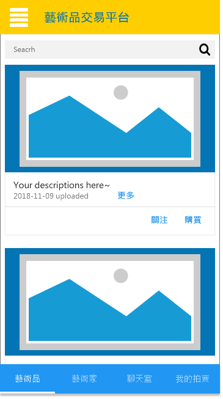

# 艺术品交易平台——需求追踪矩阵文档

 

 

## 文档信息

| 要素 | 内容                                                         |
| ---- | ------------------------------------------------------------ |
| 时间 | 2018年11月8日                                                |
| 团队 | foursomeSE                                                   |
| 成员 | 161250065 连远翔（PM） 161250014 陈骁 161250047 吉宇哲 161250051 赖健明 |

 

 

## 目录

[TOC]

 

 

 

## 1. 引言

### 1.1 目的

本文档描述了艺术品交易平台的用户需求，包括收藏家、艺术家和系统管理人员

 

### 1.2 范围

“线上艺术品交易平台”是我司开发的在线艺术品交易网站，用于艺术品的发布、交易和管理，并提供支付管理、信用管理和交易追踪等多种功能。开发的目标是打破艺术品交易市场交流不畅的现状，为艺术家和收藏家建立有效的沟通渠道。

通过本系统的发布和应用，期望为我司带来一定的经济效益，通过更多的艺术家和收藏家使用本平台，达到扩大平台影响力、优化艺术品交易市场的目的。

本平台遵守相关的法律法规，严格控制虚假艺术品信息、压货不发、尾款赖账等现象。此外，本平台默认用户有可以访问网络的智能手机和电脑，并可以获取一部分用户信息以便进行认证。

 

### 1.3 参考文献

- [1] 需求工程:软件建模与分析，骆斌、丁二玉，高等教育出版社，2009-04-01，ISBN：9787040262957
- [2]《艺术品交易平台用例文档》
- [3]《艺术品交易平台涉众分析文档》

 

 

 

## 2. 总体描述

### 2.1 产品前景

对想要寻找到心仪的艺术品和得到交易安全保障的收藏家来说，“线上艺术品交易平台”能够为他们展示艺术品的详细信息和历史交易记录，帮助他们判断艺术品的价值，并且通过艺术家认证，信用体系的建立和交易过程的全记录，使艺术家的信用得到保障，让用户在交易的时候没有后顾之忧。

对于想要卖出艺术品或者得到更多关注的艺术家来说，本平台设立关注和收发动态机制，能让艺术家获得更多关注并对自己的艺术品做宣传， 对于管理员来说，本平台能够将交易记录和所有聊天记录保存，将用户和艺术品信息持久保存和可视化，能够方 便他们的工作和管理。

 

### 2.2 业务需求

- BR1：在第一版应用之后，能够追踪系统内所有艺术品的每一笔交易记录
- BR2：在第一版应用之后的6个月后，出现艺术家无法交出艺术品或收藏家不支付尾款的情况减少到1%
- BR3：在第一版应用之后的6个月后，艺术品分享到社交平台的数量达到1万次以上
- BR4：在第一版应用之后的6个月后，艺术品的总浏览量达到5万次以上
- BR5：在第一版应用之后的六个月内，收藏家预约艺术家线下交流达到1万次以上
- BR6：在第一版应用之后的六个月内，收藏家和艺术家线上聊天记录达到10万条以上

 

### 2.3 用户特征

| 用户   | 用户特征                                                     |
| ------ | ------------------------------------------------------------ |
| 收藏家 | 通过本平台找到自己心仪的艺术品，希望和得到认证的艺术家近距离交流 |
| 艺术家 | 通过本平台宣传和发布自身作品，希望保证交易的安全可靠         |
| 管理员 | 系统管理和维护人员，使用系统管理统计信息或者处理投诉，并对出现重大恶劣情况的用户进行封号等操作，以提高用户体验 |

 

### 2.4 约束

- CON1：系统可以运行在Chrome、Firefox、Edge、Safari浏览器上

- CON2：项目采用持续集成方法

- CON3：开发中，开发者提供软件规格需求文档、设计描述文档、测试报告

 

### 2.5 假设和依赖

- AS-1：系统的潜在用户，即艺术家和收藏家有能够上网的设备，如智能手机和 PC 机。

- DE-1：需要和第三方支付平台进行集成，可以双向通信和变更。

 

 

 

## 3. 詳細需求描述

### 3.1 對外接口需求

#### 3.1.1 用戶界面

##### UI1 移動端首頁

- UI1.1 點擊"更多"查看藝術品詳細信息
- UI1.2 點擊"關注", 彈出對話框提示"關注藝術品成功"
- UI1.3 點擊購買, 彈下以下對話框

    - UI1.3.1 點擊"支付寶", 跳到支付寶進行付款
    - UI1.3.2 點擊"微信支付", 跳到微信進行付款
    - UI1.3.3 點擊"聯絡賣家", 前往聊天室發送線下交流申請

- UI1.4 向下滑動可繼續顯示藝術品
- UI1.5 可在上方搜索欄進行藝術品的搜索
- UI1.6 "藝術品圖片"可左右滑動查看

 

##### UI2 藝術家大廳

- UI2.1 點擊"預約線下", 跳到聊天室發送線下交流申請
- UI2.2 點擊"聊天", 跳到聊天室與藝術家進行交流
- UI2.3 點擊"關注", 彈出對話框提示"關注藝術家成功"
- UI2.4 點擊"藝術家名稱"或者"藝術家頭像"可進入個人主頁
- UI2.5 可在上方搜索欄進行藝術家的搜索

 

##### UI3 聊天室

- UI3.1 可選擇"接受"或"拒絕"對方的線下交流申請

 

##### UI4 發起拍賣

- UI4.1 點擊"圖片"可以選擇上傳藝術品的照片
- UI4.2 點擊"提交", 彈出對話框提示"提交成功"
- UI4.3 點擊"取消", 退出當前頁面

 

##### UI5 登記商品

- UI5.1 點擊"圖片"可以選擇上傳藝術品的照片
- UI5.2 點擊"提交", 彈出對話框提示"提交成功"
- UI5.3 點擊"取消", 退出當前頁面

 

##### UI6 競投詳情

- UI6.1 點擊"聯絡作者", 跳到與作者的聊天室
- UI6.2 點擊"追加競投"可以再次叫價

 

##### UI7 歷史訂單

- UI7.1 點擊"詳情", 彈出對應訂單的詳情

 

##### UI8 管理員

- UI8.1 需要進行登入, 詳見UI9
- UI8.2 點擊圖表可以查看詳細
- UI8.4 管理員可以點擊"選項", 選擇下架

 

##### UI9 管理員登入

 

 

### 3.2 用户和功能需求

#### 3.2.9 管理统计信息

##### 3.2.9.1 特性描述

管理员可以对平台的统计信息进行统计和分析，规划平台的日后发展

##### 3.2.9.2 刺激/相应序列

刺激：管理员对用户的注册统计信息进行查看

响应：系统显示用户的注册统计信息

刺激：管理员按照年月日筛选注册统计信息

响应：系统显示对应日期的注册统计信息

刺激：管理员对查看用户的邀请排行

响应：系统显示用户的邀请排行

刺激：管理员查看用户排行

响应：系统显示用户排行

刺激：管理员按照评价和交易量为因素对用户进行排序

响应：系统显示重新排序后的用户排行列表

刺激：管理员选择导出报表

响应：系统将数据导出报表并将报表保存

##### 3.2.9.3 相关功能需求

| 接口名 | 需求内容 |
| ------ | -------- |
| ManageStatistics.showRegisterInfo |系统允许管理员查看用户的注册统计信息|
| ManageStatistics.queryRegisterInfo |系统允许管理员根据年月日查看用户的注册统计信息|
| ManageStatistics.showInvitationRanking |系统允许管理员查看用户的邀请排行|
| ManageStatistics.showUserRanking |系统允许管理员查看用户排行|
| ManageStatistics.resort |管理员可以对用户进行排序|
| ManageStatistics.export |管理员可以导出报表并保存|

 

#### 3.2.10 查看交易

##### 3.2.10.1 特性描述

管理员可以查看平台的交易，并对交易中出现的异常进行处理

##### 3.2.10.2 刺激/相应序列

刺激：管理员按照交易时间、交易人、交易编号进行筛选或搜索

响应：系统显示交易的搜索结果

刺激：管理员点击要查看的交易

响应：系统显示该交易的详细信息

刺激：管理员对交易人进行警告或封号

响应：系统执行管理员的处罚并通知用户

##### 3.2.10.3 相关功能需求

| 接口名 | 需求内容 |
| ------ | -------- |
| CheckDeal.queryDeals |系统允许管理员筛选或搜索交易信息|
| CheckDeal.showDealInfo |系统允许管理员查看交易的详细信息|
| CheckDeal.warn |管理员可以对用户进行警告|
| CheckDeal.ban |管理员可以对用户进行封号|

 

#### 3.2.11 查看发布

##### 3.2.11.1 特性描述

管理员可以查看在平台发布的艺术品，并对异常的发布进行处理

##### 3.2.11.2 刺激/相应序列

刺激：管理员对发布的艺术品的发布者，名称和艺术品 ID 进行筛选或搜索

响应：系统显示艺术品的搜索结果

刺激：管理员点击要查看的艺术品

响应：系统显示该艺术品的详细信息

刺激：管理员撤销该艺术品的发布

响应：系统执行管理员的处罚并通知用户

刺激：管理员对交易人进行警告或封号

响应：系统执行管理员的处罚并通知用户

##### 3.2.11.3 相关功能需求

| 接口名 | 需求内容 |
| ------ | -------- |
| CheckArtwork.queryArtwork |系统允许管理员筛选或搜索发布的艺术品|
| CheckArtwork.showArtworkInfo |系统允许管理员查看艺术品的详细信息|
| CheckArtwork.revoke |管理员可以撤销用户发布的艺术品|
| CheckArtwork.warn |管理员可以对用户进行警告|
| CheckDeal.ban |管理员可以对用户进行封号|

 

 

### 3.3 非功能需求
#### 3.3.1 安全性
- Safety1: 系統按照用戶身驗證用戶的訪問權限
    - 僅系統管理可以查看圖表、下架藝術品
    - 普通用戶可以登記藝術品、發起拍賣、參與拍賣、關注藝術家/藝術品
- Safety2: 普通用戶的個人信息應該加密存儲，避免信息泄露
- Safety3: 普通用戶發起拍賣、參與拍賣前, 必須進行實名身份驗證

 

#### 3.3.2 可維護性
- Modifiability1：如果有新的管理員加, 應在三天內為其分配管理員帳戶
- Modifiability2：普通用戶的身份驗證需在兩天內完成

 

#### 3.3.3 易用性
- Usability1：系统应同时提供表格化和模块化的视图 
- Usability2：系统 app 的字体大小、颜色主题应可变更
- Usability3：就诊记录所有相关文字应可复制 

 

#### 3.3.4 約束
- Constraint1: 系統采用IOS版本、Android版本、Web(管理員)開發
- Constraint2: 系統不處理線下購買的付費問題
- Constraint3：用户通过系统达成的私下协议，系统不予干涉，也不承担相应责任

 

#### 3.3.5 質量屬性
- QR1: 系統管理員只能查看，不能修改、刪除用戶的個人信息，但可以修改用戶賬號的狀態
- QR2: 系統管理員只能查看，不能修改、刪除藝術品的信息，但可以修改藝術品的狀態
- QR3：在进行数据的下载和上传中，如果网络出现故障，系统不能出现故障。  
    - QR3.1：系统应该检测到网络故障，并不断尝试重新连接网络 5分钟，每 15 秒一次。
    - QR2.2.1：重新连接后，系统能够继续之前的工作。   - QR2.2.2：若连接不成功，重复尝试连接。 

 

#### 3.3.6 業務規則
- BR1: 參與拍賣、叫價競投(用戶選擇一個藝術品, 輸入競投價)
- BR2: 發起拍賣(用戶選擇已登記藝術品, 填寫資料)
- BR3: 關注藝術品和藝術品(用戶查看藝術品、藝術品點擊確認)
- BR4: 查看藝術品的交易紀錄(用戶點擊商品, 查看交易紀錄)
- BR5: 預約線下交流(用戶對藝術家發起申請, 藝術家同意即可)
- BR6: 聊天(用戶與藝術家之間可以通過系統進行聊天)

 

#### 3.3.7 其它需求
- OR1：用户初次使用应用时，需要对用户进行短暂的操作示例教程。 

 

 

### 3.4 數據需求
#### 3.4.1 數據要求
- DR1：系统需要存储用户所有订单信息 
- DR2：服务器更换时，要确保所有数据的完美移植，保持数据的一致性 
- DR3：系统初期就应具有内置的资料，后续再进行大规模的添加 
- DR4：系统弃用时，需保证用户信息的保密性，防止信息外泄 

 

#### 3.4.2 默認數據
- Default1: 藝術家中心和藝術品中心默認按照更新時間排序
- Default2: 登录时默认使用上次登录的账号密码
- Default3: 付款方式默認選擇支付寶
- Default4: 出售方式默認為拍賣

 

#### 3.4.3 数据格式要求 
- Format1：用户帐号名应为只包含数字、字符不超过 10位的字符串，密码为只包含数字、字符不超过 15 位的字符串 
- Format2：用户手机号应为有效的中华人民共和国 11位手机号 
- Format3：订单编号为 8位数字 
- Format4：用户的身份证号应为有效的中华人民共和国 18 位身份证号 
- Format5：所有金额应精确到小数点后两位 

 

#### 3.5 其他需求 
- Install1：客户端只有安卓与 IOS端 
- Install2：后台只有桌面端，系统要求为 Windows7及以上 
- Install3：系统投入使用时，需要对网站管理人员进行 1个小时的新手指导教程 